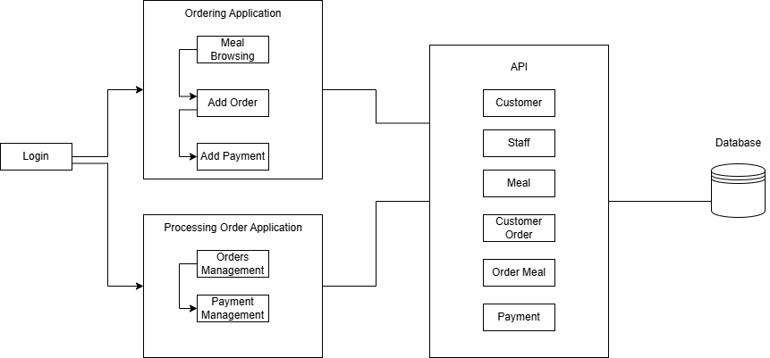
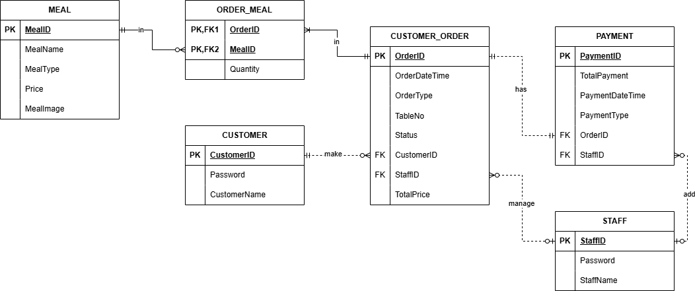

# RestaurantOrderingSystem

For the BITP3123 project, we are tasked with developing a comprehensive restaurant ordering system. This system will consist of two primary applications: the ordering application and the processing orders application.

## Ordering Application
The ordering application is designed to facilitate customer interactions with the restaurant. Customers will begin by performing a simple login process. Once logged in, they can proceed to order food by choosing meals categorized by type, such as Food or Beverage. Customers have the ability to add meals to their order, review the selected items, delete any if necessary, and confirm their meal choices. Additionally, customers can specify whether they wish to eat in or take away.

After finalizing their order, customers will move on to the payment process. The system will provide various payment options, including cash, e-wallet, credit card, and online banking. Although the system will simulate payment success without executing real transactions, if a customer selects cash as the payment method, the order status will be marked as 'unpaid'.

Furthermore, customers can check their orders, both paid and unpaid, and view the status of their orders through the system.

## Processing Orders Application
The processing orders application is designed for restaurant staff to manage and process customer orders efficiently. Staff members will start by logging into the system with a simple login process. They can then check the list of orders, focusing on the paid orders (excluding those that are completed or canceled).

Staff have the capability to change the status of an order as required. They can also access the ordering and payment history, viewing details of completed and canceled orders along with their payment records. The system allows staff to delete an order and its associated payment record if necessary.

Additionally, staff can manage unpaid orders by viewing the list of unpaid orders and confirming payments. They can change the status of an order to indicate whether it is pending, in progress, completed, or canceled.

By incorporating these functionalities, the restaurant ordering system aims to streamline the ordering process for customers and facilitate efficient order management for restaurant staff.

## Architecture Diagram

## List of URL end points middleware RESTful
1. https://hushed-charming-clipper.glitch.me/customer
2. https://hushed-charming-clipper.glitch.me/staff
3. https://hushed-charming-clipper.glitch.me/customer_order
4. https://hushed-charming-clipper.glitch.me/customer_order/personal
5. https://hushed-charming-clipper.glitch.me/meal
6. https://hushed-charming-clipper.glitch.me/order_meal
7. https://hushed-charming-clipper.glitch.me/payment

## Functions/Features in the middleware
1. Read customer and staff from database to authenticate the logged in user.
2. Read customer orders from database base on ordering status or customer id.
3. Add new customer orders and order meals to database.
4. Update customer orders status in database base on order id.
5. Delete customer orders and order meals from database base on order id.
6. Read meals from database base on meal type.
7. Add and delete payment to database base on order id.

## The database and tables involve in the projects
### ERD

